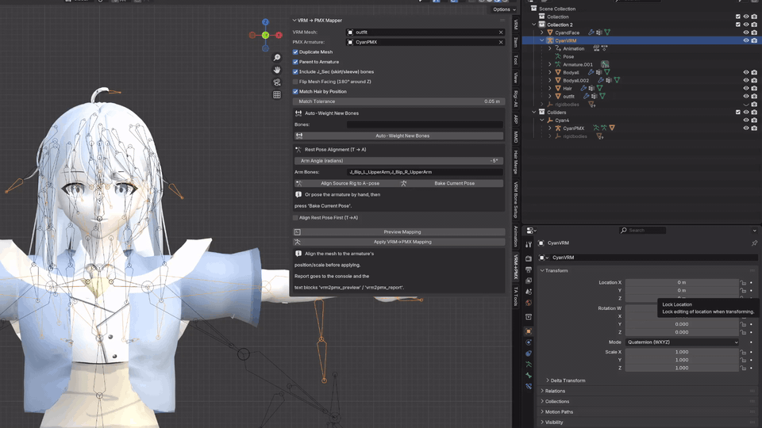
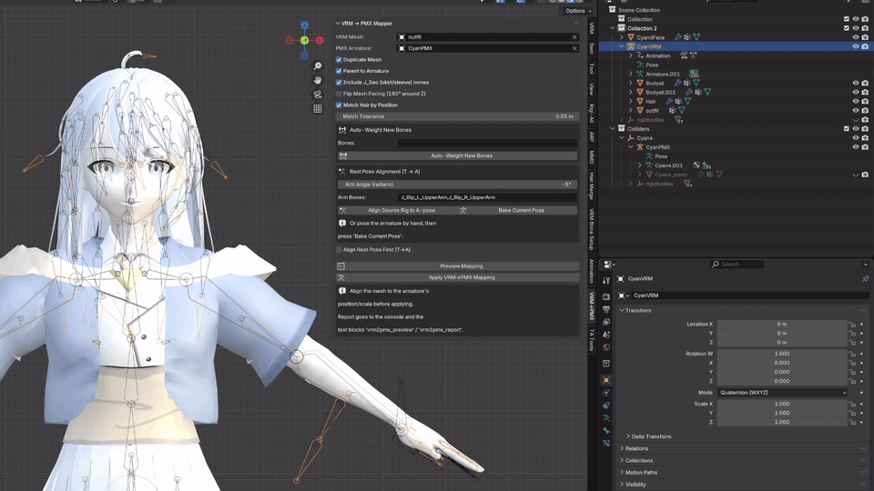
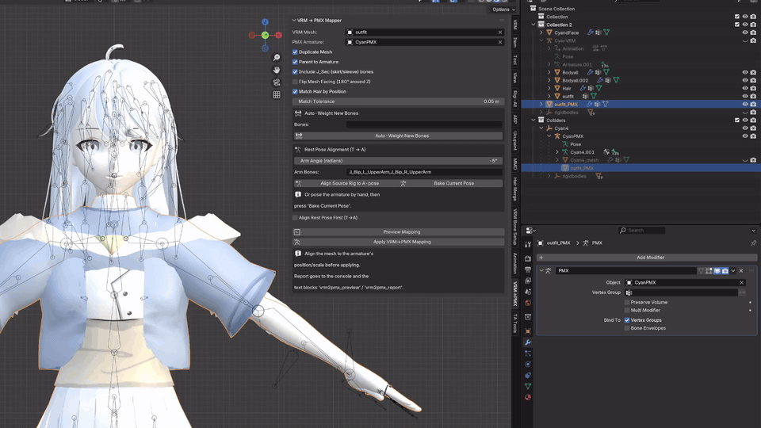

# VRM → PMX Bone Mapper

A Blender add-on that retargets a mesh rigged to a **VRM** skeleton
(`J_Bip_*` naming, T-pose) onto a **PMX** armature (MMD Japanese bone
names, A-pose) — without recomputing any weights by hand.

> ⚠️ **VRM 0.0 format only.** Models in the VRM 1.x format are not
> supported.

| | |
|---|---|
| **Version** | 1.4.1 |
| **Blender** | 4.5+ |
| **Category** | Rigging |
| **Panel** | 3D Viewport → Sidebar → `VRM→PMX` |

---

## What it does

- **Remaps vertex groups** `J_Bip_*` → PMX bone names
  (`J_Bip_L_UpperArm` → `腕.L`, `J_Bip_L_UpperLeg` → `足.L`, …) and
  attaches the mesh to the PMX armature.
- **Aligns the rest pose** from VRM T-pose to PMX A-pose (arm rotation
  around local X, deformation baked into the mesh, `TPose` shape key
  kept as backup).
- **Flips mesh facing** 180° around Z (VRM avatars face +Z in Blender,
  MMD/PMX models the opposite direction).
- **Maps hair by bone position** — PMX hair chains (`髪_01-01 … 髪_22-04`)
  are re-splits of the VRM strands, so `J_Sec_Hair*` groups are matched
  to the nearest `髪_*` bone head instead of by name.
- **Auto-weights newly added bones** using Blender's built-in automatic
  weighting, scoped to the new bones only — existing groups stay
  untouched.
- Prints a full mapping report to the console and saves it as the text
  block `vrm2pmx_report` / `vrm2pmx_preview`.

---

## Demos

### Step 1 — Pose the arms to A-pose



### Step 2 — Map VRM → PMX



### Step 3 — Rotate 180° and apply



---

## Install

1. **Edit → Preferences → Add-ons → Install…** and select
   `vrm_to_pmx_mapper/__init__.py` (or zip the folder).
2. Enable **VRM to PMX Bone Mapper**.
3. Open the sidebar in the 3D Viewport (**N**) → tab `VRM→PMX`.

> *Developers:* install from a directory and use
> **F3 → “Reload Scripts”** after edits, or junction the source folder
> into the addons directory:
>
> ```
> mklink /J "%APPDATA%\Blender Foundation\Blender\4.5\scripts\addons\vrm_to_pmx_mapper" "C:\path\to\bone\vrm_to_pmx_mapper"
> ```

## Usage — three steps

### Step 1 — Put the VRM mesh into the A-pose

Select the VRM armature and switch to **Pose Mode**.

- Either: select the left arm bone and set **X rotation to −0.3** in
  the **Item** panel,
- or: select the left arm bone and press `R` → `Y` → `-33.3`, then
  the right arm bone with `R` → `Y` → `33.3`,
- then **set a keyframe** on the arm bones.

Still on the VRM mesh:

1. **Delete all shape keys** from the mesh
   (⚠️ this is why facial conversion is not recommended — this
   workflow is for the body).
2. **Apply the Armature modifier**
   (Modifier panel → `⌄` → *Apply*) — the mesh is now baked into the
   A-pose.

---

### Step 2 — Map VRM → PMX

In the `VRM→PMX` sidebar panel:

1. Select the converted mesh and pick it as **VRM Mesh**.
2. Select the PMX armature and pick it as **PMX Armature**.
3. Click **Apply VRM→PMX Mapping**.

The mesh is now skinned to the PMX skeleton.

---

### Step 3 — Face it forward

The mapped mesh faces the wrong way, so:

1. Select the converted mesh.
2. Press `R` → `Z` → `180` → `Enter`.
3. Press `Ctrl+A` → **Rotation** to apply it.

Done 🎉

## Panel options

| Option | Default | What it does |
|---|---|---|
| VRM Mesh | — | Source mesh with `J_Bip_*` vertex groups |
| PMX Armature | — | Target armature with PMX Japanese bone names |
| Duplicate Mesh | ✔ | Work on a `<name>_PMX` copy, keep the original |
| Parent to Armature | ✔ | Parent the mesh to the PMX armature (transform preserved) |
| Include J_Sec (skirt/sleeve) | ✘ | Map `J_Sec_*` → `装飾_*` bones by name suffix |
| Flip Mesh Facing | ✘ | Bakes a 180° Z rotation into the mesh data (only if the mesh faces backward) |
| Match Hair by Position | ✔ | `J_Sec_Hair*` → nearest `髪_*` bone head |
| Match Tolerance | 0.05 m | Max head distance for position matching |
| Arm Angle | −0.3 rad | Arm rotation around local X for the T→A alignment |
| Arm Bones | `J_Bip_L_UpperArm`, `J_Bip_R_UpperArm` | Bones rotated for the alignment |
| Bake Current Pose (button) | — | Bake the current armature pose into the mesh and reset the pose |
| Bones (auto-weight) | *(empty)* | Bones to auto-weight; empty = every deform bone missing a group |

## Main mapping table

<details>
<summary>Expand — VRM → PMX defaults</summary>

| VRM (source) | PMX (target) |
|---|---|
| `J_Bip_C_Hips` | `腰` |
| `J_Bip_C_Spine` | `上半身` |
| `J_Bip_C_Chest` | `上半身2` |
| `J_Bip_C_UpperChest` | `上半身3` |
| `J_Bip_C_Neck` / `J_Bip_C_Head` | `首` / `頭` |
| `J_Bip_{L,R}_Shoulder` | `肩.{L,R}` |
| `J_Bip_{L,R}_UpperArm` | `腕.{L,R}` |
| `J_Bip_{L,R}_LowerArm` | `ひじ.{L,R}` |
| `J_Bip_{L,R}_Hand` | `手首.{L,R}` |
| `J_Bip_{L,R}_Thumb1/2/3` | `親指０/１/２.{L,R}` |
| `J_Bip_{L,R}_Index1/2/3` | `人指１/２/３.{L,R}` |
| `J_Bip_{L,R}_Middle1/2/3` | `中指１/２/３.{L,R}` |
| `J_Bip_{L,R}_Ring1/2/3` | `薬指１/２/３.{L,R}` |
| `J_Bip_{L,R}_Little1/2/3` | `小指１/２/３.{L,R}` |
| `J_Bip_{L,R}_UpperLeg` | `足.{L,R}` |
| `J_Bip_{L,R}_LowerLeg` | `ひざ.{L,R}` |
| `J_Bip_{L,R}_Foot` | `足首.{L,R}` |
| `J_Bip_{L,R}_ToeBase` | `つま先.{L,R}` |
| `J_Adj_{L,R}_FaceEye` | `目.{L,R}` |
| `J_Sec_{L,R}_Bust1/2` | `胸.{L,R}` / `胸先.{L,R}` |
| `J_Sec_*` (opt-in) | `装飾_*-*_…` by name suffix |
| `J_Sec_Hair*` (opt-in) | `髪_*` by bone-head proximity |

Customize anything via the `OVERRIDES` dict at the top of
`vrm_to_pmx_mapper/__init__.py`.

</details>

## Troubleshooting

| Symptom | Fix |
|---|---|
| Mesh faces backward, spine looks fine | Enable **Flip Mesh Facing** (bakes a 180° rotation into the mesh data) |
| Arms bent wrong / detach from the body | Run **Align Source Rig to A-pose** (or enable **Align Rest Pose First**) |
| Align does nothing | Arm Angle is in radians; check the console for "rotated …" lines; make sure the armature has the listed bones |
| Hair strands 2/3/4 get no groups | Enable **Match Hair by Position**; check both armatures are aligned and at the same scale |
| New bones don't deform the mesh | Run **Auto-Weight New Bones** after adding them |
| Some groups skipped | Read the report in the console / text block `vrm2pmx_report` — it lists every skipped group with a reason |

## Files

- `vrm_to_pmx_mapper/__init__.py` — the add-on (installable)
- `quick_map.py` — run inside Blender without installing the add-on
- `tests/test_headless.py` — headless self-test
  (`blender -b --factory-startup -P tests/test_headless.py`)
- `docs/developer.md` — developer notes, caveats and dev-loop workflow
